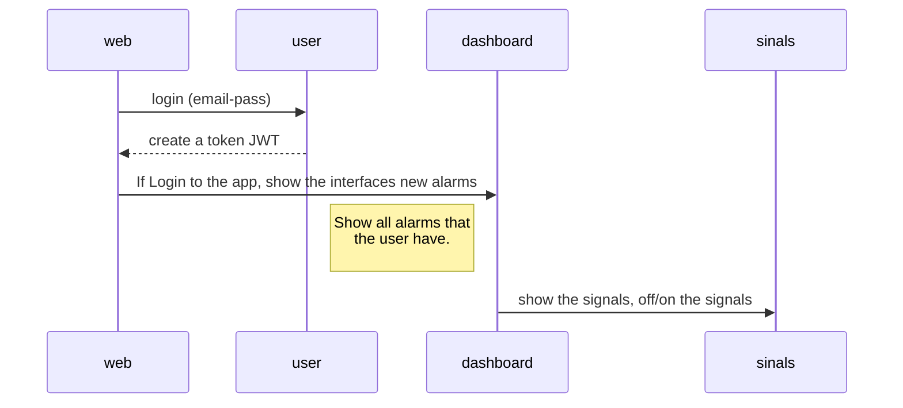

## MELI CHALLENGE
## :clipboard: ABOUT

Web platform for telemetry applications and control of operational variables in home utility companies.

## :rocket: BUILD
[](https://nodesource.com/products/nsolid)
# I use a number of open source libraries to work properly:
- [Angular 11 ](https://angular.io/) as javascript framework build in react.

## :floppy_disk: TECHNICAL REQUIREMENTS
# Client: 
- 1. HTML
- 2. Angular components
- 3. CSS

## :gear: USAGE
```sh
cd senales-iot
npm install
npm start
http://localhost:4200
```



## :page_facing_up: License

MIT

**Coding with passion :heavy_heart_exclamation:!**
